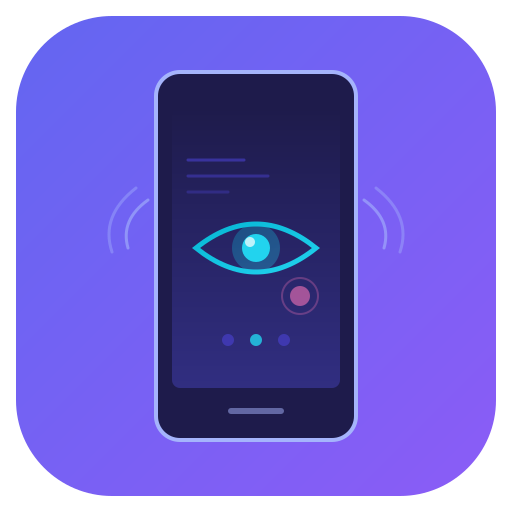

<p align="center">
  
</p>

<h1 align="center">mobile-device-mcp</h1>

<p align="center">
  <a href="https://www.npmjs.com/package/mobile-device-mcp"></a>
  <a href="https://www.npmjs.com/package/mobile-device-mcp"></a>
  <a href="https://github.com/saranshbamania/mobile-device-mcp"></a>
  <a href="LICENSE"></a>
</p>

MCP server that gives AI coding assistants (Claude Code, Cursor, Windsurf) the ability to **see and interact with mobile devices**. 49 tools for screenshots, UI inspection, touch interaction, AI-powered visual analysis, Flutter widget tree inspection, video recording, and test generation.

> AI assistants can read your code but can't see your phone. This fixes that.

## Why This One?

| Feature | mobile-device-mcp | mobile-next/mobile-mcp | appium/appium-mcp |
|---------|:-:|:-:|:-:|
| Total tools | **49** | 20 | ~15 |
| Setup | `npx` (30 sec) | `npx` | Requires Appium server |
| AI visual analysis | **12 tools** (Claude + Gemini) | None | Vision-based finding |
| Flutter widget tree | **10 tools** (Dart VM Service) | None | None |
| Smart element finding | **4-tier** (<1ms local search) | Accessibility tree only | XPath/selectors |
| Companion app (23x faster UI tree) | Yes | No | No |
| Video recording | Yes | No | No |
| Test script generation | **TS, Python, JSON** | No | Java/TestNG only |
| iOS simulator support | Yes | Yes | Yes |
| iOS real device | Planned | Yes | Yes |
| Screenshot compression | **89%** (251KB->28KB) | None | 50-80% |
| Multi-provider AI | Claude + Gemini | N/A | Single provider |
| Price | Free + Pro (₹499/mo) | Free | Free |

## The Problem

Web developers have browser DevTools, Playwright, and Puppeteer -- AI assistants can click around, take screenshots, and verify fixes. Mobile developers? They're stuck manually screenshotting, copying logs, and describing what's on screen. They're **human middleware** between the AI and the device.

## What This Does

```
Developer: "The login button doesn't work"

Without this tool:                    With this tool:
  1. Manually screenshot              1. AI calls take_screenshot -> sees the screen
  2. Paste into AI chat               2. AI calls smart_tap("login button") -> taps it
  3. AI guesses what's wrong          3. AI calls verify_screen("error message shown") -> sees result
  4. Apply fix, rebuild               4. AI calls visual_diff -> confirms fix worked
  5. Repeat 4-5 times                 5. Done.
```

## Quick Start

### Install

```bash
npx mobile-device-mcp
```

No global install needed. Runs directly via npx.

### Prerequisites
- Node.js 18+
- Android device/emulator connected via ADB
- ADB installed ([Android SDK Platform Tools](https://developer.android.com/tools/releases/platform-tools))

### Setup (One-time, 30 seconds)

1. **Get a Google AI key** (free tier available): [aistudio.google.com/apikey](https://aistudio.google.com/apikey)

2. **Add `.mcp.json` to your project root:**

**macOS / Linux:**
```json
{
  "mcpServers": {
    "mobile-device": {
      "type": "stdio",
      "command": "npx",
      "args": ["-y", "mobile-device-mcp"],
      "env": {
        "GOOGLE_API_KEY": "your-google-api-key"
      }
    }
  }
}
```

**Windows:**
```json
{
  "mcpServers": {
    "mobile-device": {
      "type": "stdio",
      "command": "cmd",
      "args": ["/c", "npx", "-y", "mobile-device-mcp"],
      "env": {
        "GOOGLE_API_KEY": "your-google-api-key"
      }
    }
  }
}
```

**With Pro license key** (after [purchasing Pro](https://rzp.io/rzp/r4ijQsJY)):

<details>
<summary>macOS / Linux (Pro)</summary>

```json
{
  "mcpServers": {
    "mobile-device": {
      "type": "stdio",
      "command": "npx",
      "args": ["-y", "mobile-device-mcp"],
      "env": {
        "GOOGLE_API_KEY": "your-google-api-key",
        "MOBILE_MCP_LICENSE_KEY": "MDMCP-XXXXX-XXXXX-XXXXX-XXXXX"
      }
    }
  }
}
```
</details>

<details>
<summary>Windows (Pro)</summary>

```json
{
  "mcpServers": {
    "mobile-device": {
      "type": "stdio",
      "command": "cmd",
      "args": ["/c", "npx", "-y", "mobile-device-mcp"],
      "env": {
        "GOOGLE_API_KEY": "your-google-api-key",
        "MOBILE_MCP_LICENSE_KEY": "MDMCP-XXXXX-XXXXX-XXXXX-XXXXX"
      }
    }
  }
}
```
</details>

3. **Open your AI coding assistant** from that directory. That's it.

The server starts and stops automatically -- you never run it manually. Your AI assistant manages it as a background process via the MCP protocol.

### Verify It Works

**Claude Code:** type `/mcp` -- you should see `mobile-device: Connected`

**Cursor:** check MCP panel in settings

Then just talk to your phone:

```
You: "Open my app, tap the login button, type test@email.com in the email field"
AI:  [takes screenshot -> sees the screen -> smart_tap("login button") -> smart_type("email field", "test@email.com")]

You: "Find all the bugs on this screen"
AI:  [analyze_screen -> inspects layout, checks for overflow, missing labels, broken states]

You: "Navigate to settings and verify dark mode works"
AI:  [smart_tap("settings") -> take_screenshot -> smart_tap("dark mode toggle") -> visual_diff -> reports result]
```

No test scripts. No manual screenshots. Just describe what you want in plain English.

### Works with Any AI Coding Assistant

| Tool | Config file | Docs |
|------|------------|------|
| **Claude Code** | `.mcp.json` in project root | [claude.ai/docs](https://claude.ai/docs) |
| **Cursor** | `.cursor/mcp.json` | [cursor.com/docs](https://cursor.com/docs) |
| **VS Code + Copilot** | MCP settings | [code.visualstudio.com](https://code.visualstudio.com) |
| **Windsurf** | MCP settings | [windsurf.com](https://windsurf.com) |

All use the same JSON config -- just put it in the right file for your editor.

### Drop Into Any Project

Copy `.mcp.json` into any mobile project -- Flutter, React Native, Kotlin, Swift -- and your AI assistant gets device superpowers in that directory. No global install needed.

## Free vs Pro

<a name="pro"></a>

### Free (14 tools) -- no license key needed

| Tool | What it does |
|------|-------------|
| `list_devices` | List all connected Android devices/emulators |
| `get_device_info` | Model, manufacturer, Android version, SDK level |
| `get_screen_size` | Screen resolution in pixels |
| `take_screenshot` | Capture screenshot (PNG or JPEG, configurable quality & resize) |
| `get_ui_elements` | Get the accessibility/UI element tree as structured JSON |
| `tap` | Tap at coordinates |
| `double_tap` | Double tap at coordinates |
| `long_press` | Long press at coordinates |
| `swipe` | Swipe between two points |
| `type_text` | Type text into the focused field |
| `press_key` | Press a key (home, back, enter, volume, etc.) |
| `list_apps` | List installed apps |
| `get_current_app` | Get the foreground app |
| `get_logs` | Get logcat entries with filtering |

### Pro (35 additional tools) -- [₹499/mo](https://rzp.io/rzp/r4ijQsJY)

**[Get Pro License](https://rzp.io/rzp/r4ijQsJY)** -- unlock all 49 tools. After payment, you'll receive your license key via email within 1 hour. Add it to your `.mcp.json`:

```json
{
  "mcpServers": {
    "mobile-device": {
      "type": "stdio",
      "command": "npx",
      "args": ["-y", "mobile-device-mcp"],
      "env": {
        "GOOGLE_API_KEY": "your-google-api-key",
        "MOBILE_MCP_LICENSE_KEY": "your-license-key"
      }
    }
  }
}
```

#### AI Visual Analysis (12 tools)

Use AI vision (Claude or Gemini) to understand what's on screen.

| Tool | What it does |
|------|-------------|
| `analyze_screen` | AI describes the screen: app name, screen type, interactive elements, visible text, suggestions |
| `find_element` | Find a UI element by description: *"the login button"*, *"email input field"* |
| `smart_tap` | Find an element by description and tap it in one step |
| `smart_type` | Find an input field by description, focus it, and type text |
| `suggest_actions` | Plan actions to achieve a goal: *"log into the app"*, *"add item to cart"* |
| `visual_diff` | Compare current screen with a previous screenshot -- what changed? |
| `extract_text` | Extract all visible text from the screen (AI-powered OCR) |
| `verify_screen` | Verify an assertion: *"the login was successful"*, *"error message is showing"* |
| `wait_for_settle` | Wait until the screen stops changing |
| `wait_for_element` | Wait for a specific element to appear on screen |
| `handle_popup` | Detect and dismiss popups, dialogs, permission prompts |
| `fill_form` | Fill multiple form fields in one step |

#### Flutter Widget Tree (10 tools)

Connect to running Flutter apps via Dart VM Service Protocol. Maps every widget to its source code location (`file:line`).

| Tool | What it does |
|------|-------------|
| `flutter_connect` | Discover and connect to a running Flutter app on the device |
| `flutter_disconnect` | Disconnect from the Flutter app and clean up resources |
| `flutter_get_widget_tree` | Get the full widget tree (summary or detailed) |
| `flutter_get_widget_details` | Get detailed properties of a specific widget by ID |
| `flutter_find_widget` | Search the widget tree by type, text, or description |
| `flutter_get_source_map` | Map every widget to its source code location (file:line:column) |
| `flutter_screenshot_widget` | Screenshot a specific widget in isolation |
| `flutter_debug_paint` | Toggle debug paint overlay (shows widget boundaries & padding) |
| `flutter_hot_reload` | Hot reload Flutter app (preserves state) |
| `flutter_hot_restart` | Hot restart Flutter app (resets state) |

#### iOS Simulator (4 tools)

macOS only. Control iOS simulators via `xcrun simctl`.

| Tool | What it does |
|------|-------------|
| `ios_list_simulators` | List available iOS simulators |
| `ios_boot_simulator` | Boot a simulator by name or UDID |
| `ios_shutdown_simulator` | Shut down a running simulator |
| `ios_screenshot` | Take a screenshot of a simulator |

#### Video Recording (2 tools)

| Tool | What it does |
|------|-------------|
| `record_screen` | Start recording the device screen |
| `stop_recording` | Stop recording and save the video |

#### Test Generation (3 tools)

| Tool | What it does |
|------|-------------|
| `start_test_recording` | Start recording your MCP tool calls |
| `stop_test_recording` | Stop recording and generate a test script |
| `get_recorded_actions` | Get recorded actions as TypeScript, Python, or JSON |

#### App Management (4 tools)

| Tool | What it does |
|------|-------------|
| `launch_app` | Launch an app by package name |
| `stop_app` | Force stop an app |
| `install_app` | Install an APK |
| `uninstall_app` | Uninstall an app |

## Performance

The server is optimized to minimize latency and AI token costs:

- **4-tier element search**: companion app (instant) -> local text match (<1ms) -> cached AI -> fresh AI. `smart_tap` is **35x faster** than naive AI calls (205ms vs 7.6s).
- **Companion app**: AccessibilityService-based Android app provides UI tree in 105ms (23x faster than UIAutomator's 2448ms). Auto-installs on first use.
- **Screenshot compression**: AI tools auto-compress to JPEG q=60, 400w -- **89% smaller** (251KB -> 28KB) with zero AI quality loss.
- **Parallel capture**: Screenshot + UI tree fetched simultaneously via `Promise.all()`.
- **TTL caching**: 5-second cache avoids redundant ADB calls for rapid-fire tool usage.

## Environment Variables

| Variable | Description | Default |
|----------|-------------|---------|
| `GOOGLE_API_KEY` or `GEMINI_API_KEY` | Google API key for Gemini vision (recommended) | -- |
| `ANTHROPIC_API_KEY` | Anthropic API key for Claude vision | -- |
| `MOBILE_MCP_LICENSE_KEY` | License key to unlock Pro tools | -- |
| `MCP_AI_PROVIDER` | Force AI provider: `"anthropic"` or `"google"` | Auto-detected |
| `MCP_AI_MODEL` | Override AI model | `gemini-2.5-flash` / `claude-sonnet-4-20250514` |
| `MCP_ADB_PATH` | Custom ADB binary path | Auto-discovered |
| `MCP_DEFAULT_DEVICE` | Default device serial | Auto-discovered |
| `MCP_SCREENSHOT_FORMAT` | `"png"` or `"jpeg"` | `jpeg` |
| `MCP_SCREENSHOT_QUALITY` | JPEG quality (1-100) | `80` |
| `MCP_SCREENSHOT_MAX_WIDTH` | Resize screenshots to this max width | `720` |

## Architecture

```
src/
|-- index.ts              # CLI entry point (auto-discovery, env config)
|-- server.ts             # MCP server factory
|-- license.ts            # License validation and tier gating
|-- types.ts              # Shared interfaces
|-- drivers/android/      # ADB driver (DeviceDriver implementation)
|   |-- adb.ts            # Low-level ADB command wrapper
|   |-- companion-client.ts # TCP client for companion app
|   +-- index.ts          # AndroidDriver class (4-strategy UI element retrieval)
|-- drivers/flutter/      # Dart VM Service driver
|   |-- index.ts          # FlutterDriver (discovery, inspection, source mapping, hot reload)
|   +-- vm-service.ts     # JSON-RPC 2.0 WebSocket client (DDS redirect handling)
|-- drivers/ios/          # iOS Simulator driver (macOS only)
|   |-- index.ts          # IOSSimulatorDriver via xcrun simctl
|   +-- simctl.ts         # Low-level simctl command wrapper
|-- tools/                # MCP tool registrations (free + pro gating)
|   |-- device-tools.ts   # Device management
|   |-- screen-tools.ts   # Screenshots & UI inspection
|   |-- interaction-tools.ts # Touch, type, keys
|   |-- app-tools.ts      # App management
|   |-- log-tools.ts      # Logcat
|   |-- ai-tools.ts       # AI-powered tools
|   |-- flutter-tools.ts  # Flutter widget inspection
|   |-- ios-tools.ts      # iOS simulator tools
|   |-- video-tools.ts    # Screen recording
|   +-- recording-tools.ts # Test generation
|-- recording/            # Test script generation
|   |-- recorder.ts       # ActionRecorder (records MCP tool calls)
|   +-- generator.ts      # TestGenerator (TypeScript/Python/JSON output)
|-- ai/                   # AI visual analysis engine
|   |-- client.ts         # Multi-provider client (Anthropic + Google)
|   |-- prompts.ts        # System prompts & UI element summarizer
|   |-- analyzer.ts       # ScreenAnalyzer orchestrator (caching, parallel capture)
|   +-- element-search.ts # Local element search (text/alias matching, no AI needed)
+-- utils/
    |-- discovery.ts      # ADB auto-discovery
    +-- image.ts          # PNG parsing, JPEG compression, bilinear resize

companion-app/            # Android companion app (Kotlin)
                          # AccessibilityService + TCP JSON-RPC for fast UI tree
```

## Roadmap

- [ ] iOS physical device support
- [ ] Multi-device orchestration
- [ ] CI/CD integration
- [ ] Cloud device farm support

## Tested On

- **Devices**: Pixel 8 (Android 16), Samsung Galaxy series, Android emulators
- **Apps**: Telegram, Instagram, Spotify, WhatsApp, YouTube, Chrome, Settings, and Flutter apps
- **AI Providers**: Google Gemini 2.5 Flash, Anthropic Claude
- **Platforms**: Windows 11, macOS (iOS simulators)
- **Connection**: USB and wireless ADB

## License

[Business Source License 1.1](LICENSE)

- **Free for individuals and non-commercial use**
- **Commercial use requires a paid license**
- Converts to Apache 2.0 on March 23, 2030

See [LICENSE](LICENSE) for full terms.
